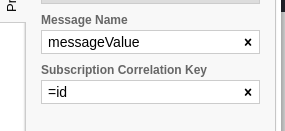

# ZeeBe Example

per questo esempio ho creato il seguente flusso


### Struttura Docker Compose

Il docker compose si occupa di avviare:

- un **broker** zeebe
- un **monitor** per zeebe
- un **servizio rest** (tramite cui si può creare una nuova instanza e nel caso anche generare un messaggio in cui il workflow si blocca per valore non presente)
- un **worker** (che entra in funzione prima di completare il flusso, è un servizio a se stante che può essere scalato sia orizontalmente che verticalmente, in caso di altri task si può decide di suddividere la logica su più worker o avere un unico worker capace di eseguire più task di diversa natura, anche in questo caso può essere scalato sia orizontalmente che verticalmente)

---

### Primo Passo

Avviare docker compose

```bash
$ docker-compose up
```

### Secondo Passo

Caricare il diagramma su ZeeBe tramite il monitor

- visitare http://localhost:8082/
- cliccare in alto a destra **_New Deployment_**
- selezionare il file *diagram_1.bpmn*
- cliccare su **_Deploy_**

ora l'ambiente è pronto

---

## Avviare una nuova instanza del work flow

### Caso 1
tramite la seguente chiamata si avvia un'instanza che completa il flusso senza bloccarsi

```bash
curl --location --request POST 'http://localhost:3000/startInstance' \
--header 'Content-Type: application/json' \
--data-raw '{
    "id": 1,
    "valore": 28
}'
```


### Caso 2
eseguedo la seguente chiamata generiamo un caso in cui l'instanza si interrompe per mancaza del valore

```bash
curl --location --request POST 'http://localhost:3000/startInstance' \
--header 'Content-Type: application/json' \
--data-raw '{
    "id": 2
}'
```


ora per poter sbloccare il flusso per l'istanza con id 2 bisogna eseguire la seguente chiamata

```bash
curl --location --request PUT 'http://localhost:3000/update/2' \
--header 'Content-Type: application/json' \
--data-raw '{
    "valore": 666
}'
```


### Di cosa si compone il messaggio (lato Zeebe)

Il messaggio per essere inviato e gestito correttamente da ZeeBe ci sono dei parametri da tenere in conto, sono:

- **Message Name**
- **Subscription Correlation Key** (ovvero il valore che permette a ZeeBe di capire a quale instanza associare il valore del messaggio ricevuto)



Per capire meglio gli esempi come funzionano e/o dare un occhio al codice basta guardare il plugin fastify **_zeebe_** e il service **_root_** presenti all'interno di **restExample**,
mentre per il **worker** basta guardare **_oddOrEvenWorker_**